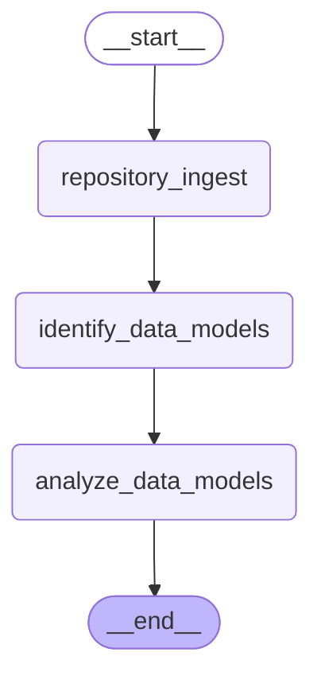

# Code Analysis API

A Python FastAPI application that provides a wrapper around a LangGraph workflow for analyzing code repositories.

## Features

- Submit repository URLs for code analysis
- Retrieve the status and results of code analysis
- Asynchronous processing using LangGraph workflow

## Requirements

- Python 3.9+
- MongoDB (can be run with Docker Compose)
- Docker and Docker Compose (optional, for running MongoDB)

## Setup

1. Clone the repository:
   ```bash
   git clone <repository-url>
   cd <repository-directory>
   ```

2. Create and activate a virtual environment:
   ```bash
   python -m venv .venv
   source .venv/bin/activate  # On Windows: .venv\Scripts\activate
   ```

3. Install dependencies:
   ```bash
   pip install -r requirements.txt
   ```

4. Configure the environment:
   ```bash
   cp .env.example .env
   # Edit .env with your specific configuration
   ```

### Setting up MongoDB with Docker Compose

For development, you can use Docker Compose to run MongoDB:

1. Start MongoDB:
   ```bash
   docker-compose up -d
   ```

   This will:
   - Start MongoDB on port 27018 (instead of the default 27017)
   - Set up authentication with a root user
   - Run a Python script to initialize the database with the necessary user, collection, and indexes

2. Verify MongoDB is running and initialized:
   ```bash
   python verify_mongodb.py
   ```

The application will automatically read the configuration from your `.env` file.

### Manual MongoDB Setup

If you prefer to use an existing MongoDB instance:

1. Configure your `.env` file with the appropriate MongoDB connection details

2. Run the MongoDB initialization script:
   ```bash
   python mongo_init.py
   ```

3. Verify MongoDB is correctly configured:
   ```bash
   python verify_mongodb.py
   ```

## Running the Application

Start the FastAPI application:

```bash
uvicorn src.main:app --reload
```

The API will be available at http://127.0.0.1:8000.

## API Documentation

Once the application is running, you can access the interactive API documentation at:

- Swagger UI: http://127.0.0.1:8000/docs
- ReDoc: http://127.0.0.1:8000/redoc

## API Endpoints

### Create Code Analysis

```
POST /api/v1/code-analysis
```

Request body:
```json
{
  "repository_url": "https://github.com/username/repository"
}
```

Response:
```json
{
  "_id": "60f7b5e42c3a8f001a123456"
}
```

### Get Code Analysis

```
GET /api/v1/code-analysis/{id}
```

Response:
```json
{
  "id": "60f7b5e42c3a8f001a123456",
  "repository_url": "https://github.com/username/repository",
  "status": "IN_PROGRESS",
  "architecture_documentation": null,
  "ingested_repository": null,
  "technologies": null,
  "created_at": "2023-07-21T10:30:00.000Z",
  "updated_at": "2023-07-21T10:30:00.000Z"
}
```

## Graph Visualizations

This section contains automatically generated visualizations of the LangGraph workflows in this project.


### create_code_analysis_graph

# Graph: create_code_analysis_graph




## Project Structure

```
src/
├── api/v1/          # Routing and HTTP endpoints
├── services/        # Business logic
├── repositories/    # Data access
├── agents/          # LangGraph AI agents
├── utils/           # Utility functions
├── config/          # Configuration
├── database/        # Database operations
└── models/          # Data models
```
