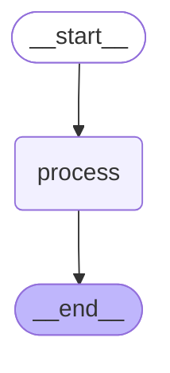
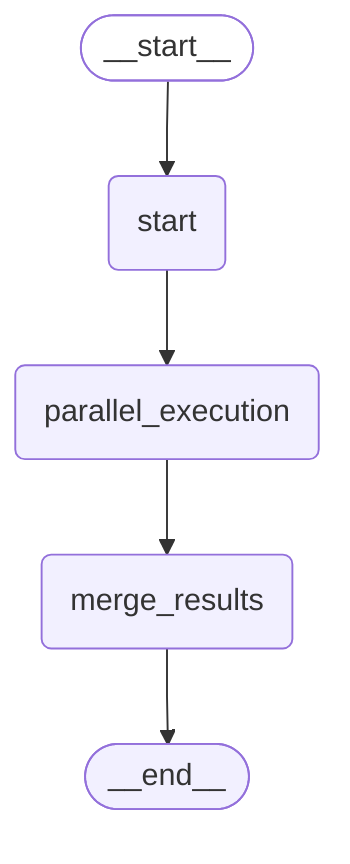

Subgraph visualization in Mermaid:

```mermaid
%%{init: {'flowchart': {'curve': 'linear'}}}%%
graph TD;
        __start__([<p>__start__</p>]):::first
        process(process)
        __end__([<p>__end__</p>]):::last
        __start__ --> process;
        process --> __end__;
        classDef default fill:#f2f0ff,line-height:1.2
        classDef first fill-opacity:0
        classDef last fill:#bfb6fc
```

Parent Graph visualization in Mermaid:

```mermaid
%%{init: {'flowchart': {'curve': 'linear'}}}%%
graph TD;
        __start__([<p>__start__</p>]):::first
        start(start)
        parallel_execution(parallel_execution)
        merge_results(merge_results)
        __end__([<p>__end__</p>]):::last
        __start__ --> start;
        merge_results --> __end__;
        parallel_execution --> merge_results;
        start --> parallel_execution;
        classDef default fill:#f2f0ff,line-height:1.2
        classDef first fill-opacity:0
```
